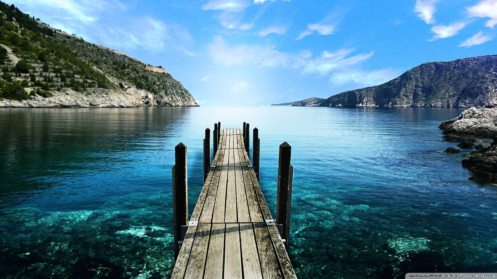
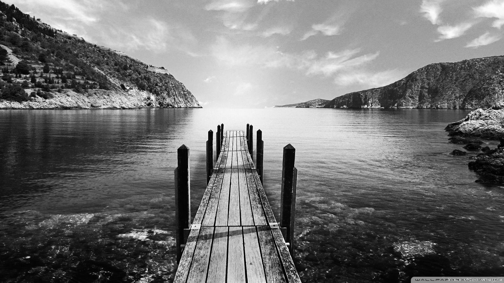

# Grayscale image using pycuda






# ⚙ How it works

The algorithm represent a data parallel implementation of image grayscaling.
Each thread will be responsible to convert one pixel of the image to gray.


# 📦 Installation

## This Repository

Download this repository by running:

```
git clone https://github.com/mrobert3456/pycuda_grayscale.git
cd pycuda_grayscale
```

## ⚡ Software Dependencies

This project utilizes the following packages:

* Python 3
* OpenCV 2
* Numpy
* [Pycuda](https://developer.nvidia.com/how-to-cuda-python)


# 🚀 Usage
To convert an image to grayscale, simply run:

```
python grayscale.py input_img.jpg
```


The output file will be saved as ```output.jpg```